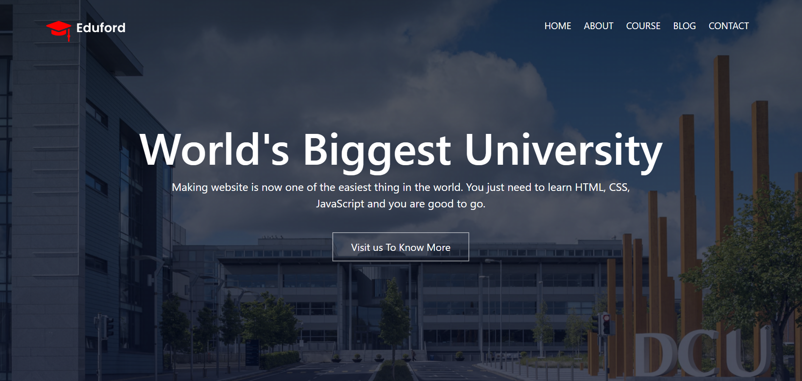

  

🚀 React College Website

A modern and fully responsive college website built using React.js.
Designed with reusable components and clean UI structure.

🔗 Live Demo:
https://ishasharma007.github.io/react-project/

✨ Features

🎯 Modern & Responsive UI

⚛️ Built with React Functional Components

📱 Mobile-Friendly Layout

🧩 Reusable Component Architecture

🚀 Optimized Production Build

🔗 Easy Deployment via GitHub Pages

🛠️ Tech Stack
Technology	Description
React.js	Frontend Library
JavaScript (ES6)	Application Logic
HTML5	Markup Structure
CSS3	Styling & Layout
Git & GitHub	Version Control
